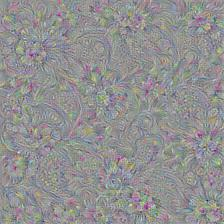
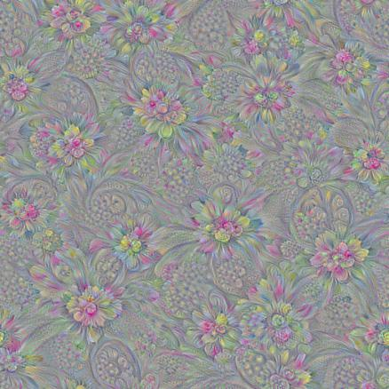
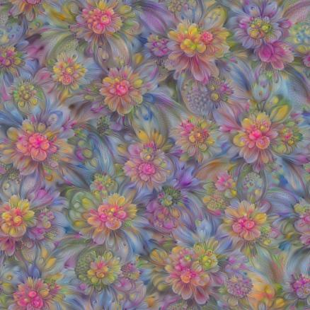
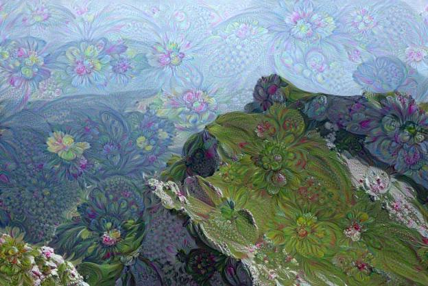

## DeepDream Model
## (DeepDream模型探索)

### 项目背景
>  本节的代码参考了TensorFlow 源码中的示例程序[https://github.com/tensorflow/tensorflow/tree/master/tensorflow/examples/tutorials/deepdream](https://github.com/tensorflow/tensorflow/tree/master/tensorflow/examples/tutorials/deepdream)，并做了适当修改。以Inception模型为基准，首先尝试获取模型某层获取到的信息，接着尝试使用分块处理法优化信息提取过程，最后分解图像的高频成分和低频成分，生成高质量DeepDream图像。

### 代码流程
|名称|作用|
|:-------------|:-------------:|
|1.load_inception|加载Inception模型并下载内部对应参数|
|2.gen_naive|标准生成能最大化某层激活效应的输入图像|
|3.gen_multiscale|使用分块图像处理法优化生成过程|
|4.gen_lapnorm|分解图像高频成分和低频成分提升生成图像的质量|
|5.gen_deepdream|以特定背景图像作为输入生成DeepDream图像|

### 效果图
#### ·标准生成能最大化某层激活效应的输入图像

#### ·使用分块图像处理法优化生成过程得到的效果

#### ·分解图像高频成分和低频成分提升生成图像的质量

#### ·以特定背景图像作为输入生成DeepDream图像（山+花朵）

#### ·以特定背景图像作为输入生成DeepDream图像（山+动物）
