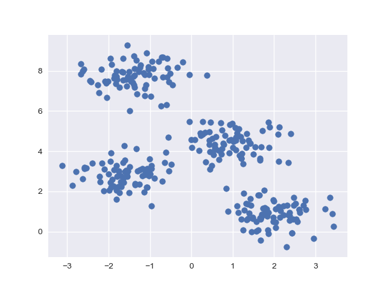
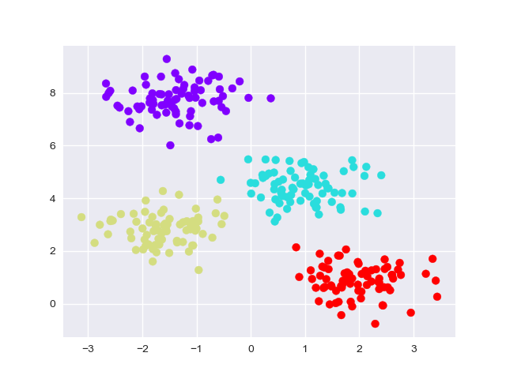
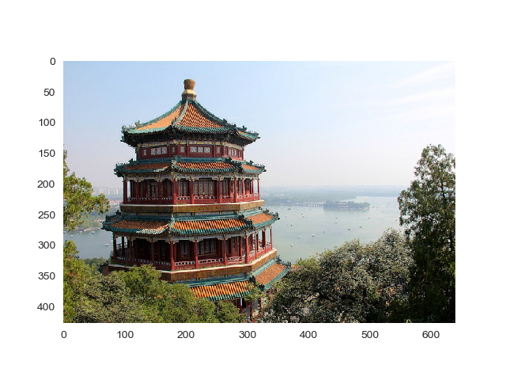
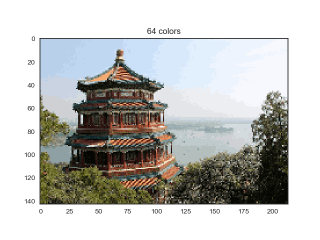

## kNN for Image Reduction (kNN图片色彩降维)

### 项目背景
>  该项目出发点在于从底层实现KMeans聚类算法在图片色彩降维上的应用，并用近邻算法kNN，实现基本的手写数字数据集的分类。
  
### 代码流程
|名称|作用|
|:-------------:|:-------------:|
|Clustering-KMeans|K-Means聚类算法实现图片的色彩降维|
|recognizing_hand-written_digits|kNN近邻算法实现手写数字识别|

### 效果图
#### ·聚类算法目标数据分布

#### ·聚类算法实现效果

#### ·色彩降维目标图片

#### ·色彩降维实现效果

