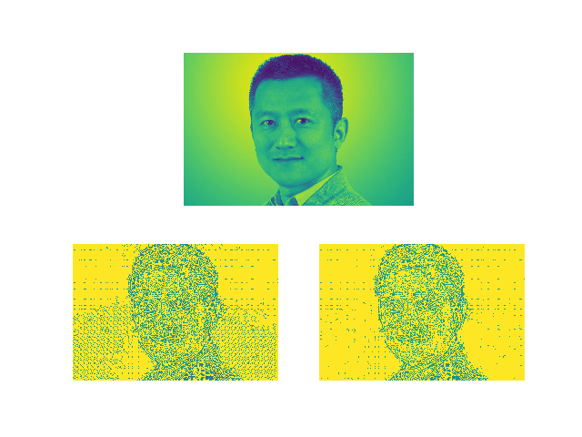
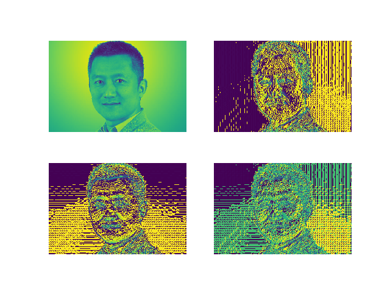
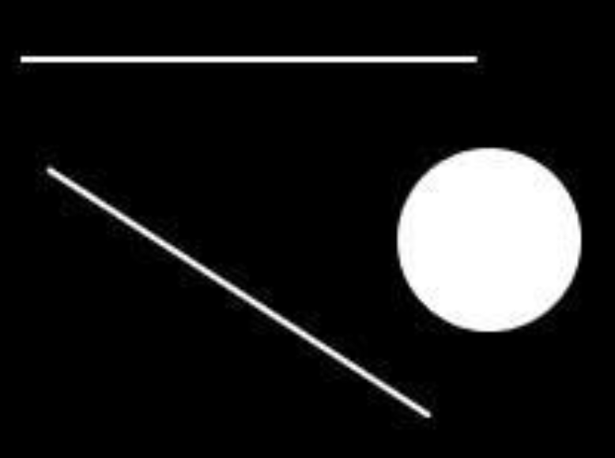
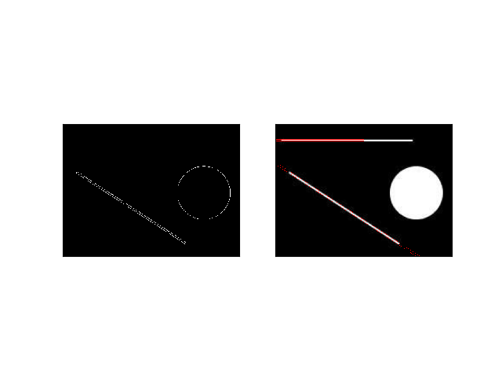

## Lane Detection (车道线检测)

### 项目背景
>  该项目出发点在于从底层实现车道线检测，其实最基本的车道线检测技术是基于边缘检测，以及霍夫曼变换算法来实现的。本项目也做了最基本的霍夫曼变换实现，以及几种主流的边缘检测算子对应实现的边缘检测算法效果。其中涉及滤波对图像的预处理，才能方便后续实现边缘检测的高精度效果。本项目也演示了一个最基本的中值滤波，中值滤波好处在于，不会受到极大值或极小值的影响，适应用于噪声比较激烈的图像模糊预处理。
  
### 代码流程
|名称|作用|
|:-------------:|:-------------:|
|edge_detection_Canny|基于Canny算子的边缘检测效果实现|
|edge_detection_Laplace|基于Laplace算子的边缘检测效果实现|
|edge_detection_Prewitt|基于Prewitt算子的边缘检测效果实现|
|edge_detection_Sobel|基于Sobel算子的边缘检测效果实现|
|hough_transform|霍夫曼变换实现|
|medium_filter|中值滤波效果实现|
|lane_detection|车道线检测实现及效果面向图片和视频|

### 效果图
#### ·边缘检测目标图片

#### ·Canny算子边缘检测实现

#### ·Laplace算子边缘检测实现

#### ·Prewitt算子边缘检测实现

#### ·Sobel算子边缘检测实现

#### ·Sobel算子OpenCV边缘检测实现

#### ·霍夫曼变换目标图片

#### ·霍夫曼变换实现效果

#### ·车道线检测目标图片

#### ·车道线检测效果图片

#### ·车道线检测分步效果图片

