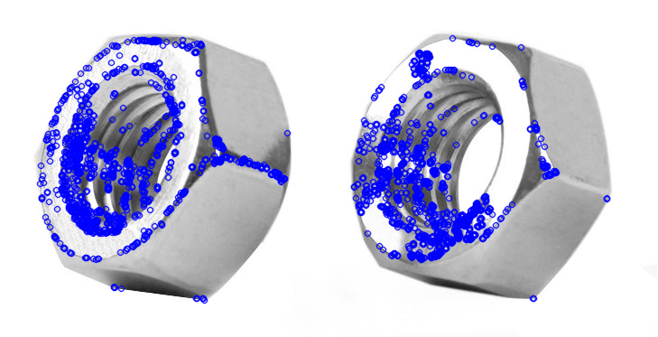
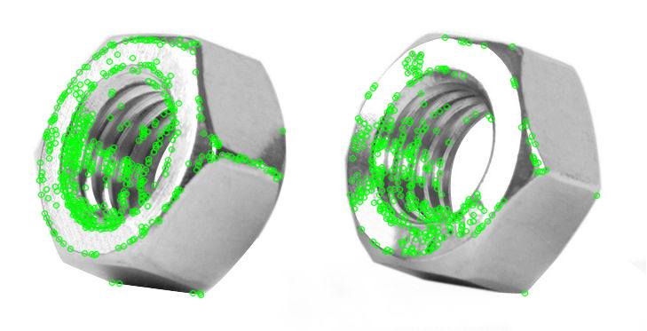
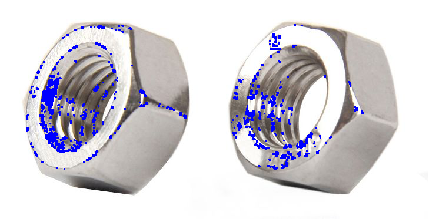
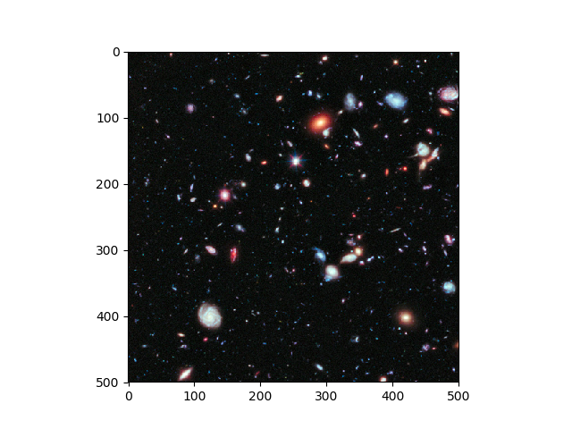
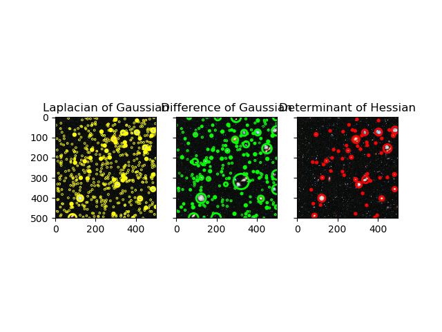
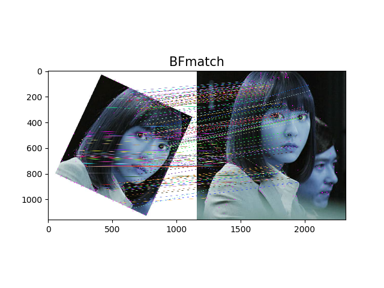
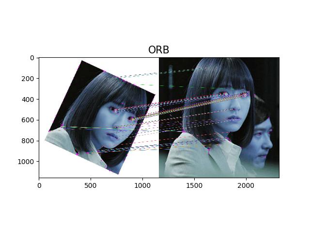
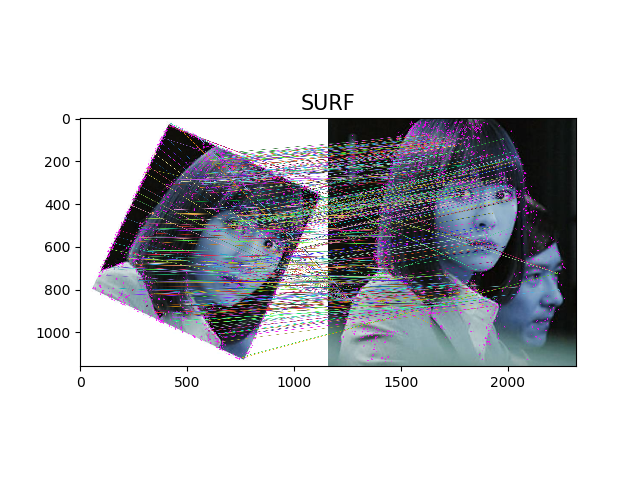

## Local Feature (局部特征)

### 背景
>  该项目出发点在于计算机视觉领域有几类基础的局部特征知识点，其中主要包括Blob Detection(斑点检测)、Corner Detection(角点检测)以及SIFT。这两类基本的局部特征对计算机视觉今后的的大型图像处理项目有着重要应用意义，尤其是在物体识别，物体检测，甚至语义分割等高层次方向。所以本项目通过对局部特征做相应的代码实现以及相应库函数的使用，展示局部特征的底层原理和应用实现效果。 其中，对于斑点检测，常见的方法有：LOG(高斯拉普拉斯算子)，DOH(Hessian矩阵)；对于角点检测，常见的方法有Harris FAST算子。
  
### 代码流程
|名称|作用|
|:-------------:|:-------------:|
|blob_detection|通过OpenCV实现LoG/DoG/DoH三种斑点检测算子效果|
|corner_detection_Fast|通过OpenCV实现FAST算法角点检测|
|corner_detection_Harris|通过OpenCV实现Harris算法角点检测|
|SIFT_BFMatcher|基于BFmatcher的SIFT实现|
|SIFT_BFMatcher_ORB|结合FAST特征点的检测方法与BRIEF特征描述子实现SIFT|
|SIFT_FlannBasedMatcher|基于快速最近邻搜索包实现SIFT|
|SURF_FlannBasedMatcher|于快速最近邻搜索包实现SURF|

### 效果图
#### ·角点检测原始图

#### ·FAST角点检测（极大值抑制）

#### ·FAST角点检测（无极大值抑制）

#### ·Harris角点检测

#### ·斑点检测原始图

#### ·斑点检测实现效果

#### ·SIFT算法目标图片
 

#### ·SIFT_BFmatch

#### ·SIFT_BFmatch_ORB

#### ·SIFT_FlannBasedMatcher

#### ·SURF_FlannBasedMatcher
