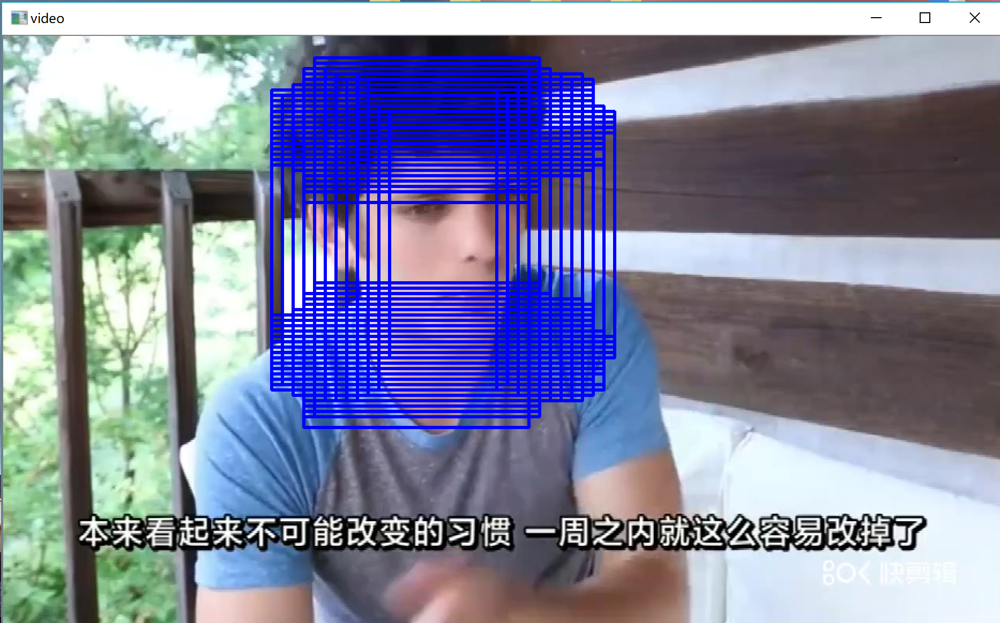
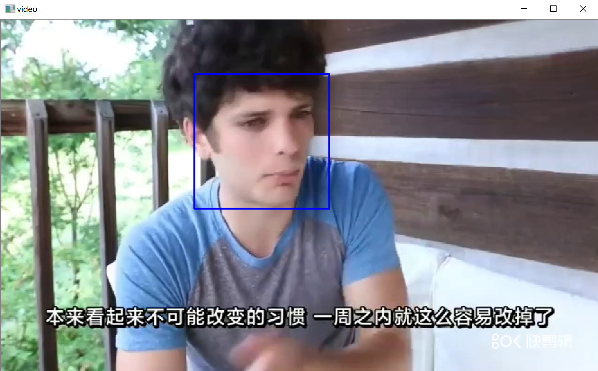

## Face Detection (人脸检测)

### 背景
>  该项目出发点在于从底层实现最基础的人脸检测算法，也就是原始的使用CNN网络训练识别器，然后在待识别的图像或是视频的某一帧中，通过一个滑动的固定形式滑窗，以一定步长间隔，在图像中做采样。（此处滑窗操作没有做任何高级处理，只是使用了最原始的方式）使用训练好的分类器对每个滑窗进行人脸识别的验证，认定为人脸的窗口我们保留滑窗坐标。然后在最后一步采取综合滑窗检测的结果，标记出人脸位置。   不同于博客上普遍存在的直接调用第三方库函数和模型，实现人脸检测。本项目从最底层的模型训练出发，以某一视频作为实验样本数据，先采样人脸和背景，分别作为正负样本，然后手动实现基于TensorFlow的图片分类器。最后再实现滑窗，使用分类器检测是否存在人脸，最后标记人脸检测结果。
  
### 代码流程
|名称|作用|
|:-------------:|:-------------:|
|1.open_video|通过OpenCV实现对样本视频的基本读取|
|2.extract_detecting_simples|从样本视频中提取人脸和背景两个正负样本|
|3.data_preprocess|对于提取出来的训练数据做预处理|
|4.CNN_training|搭建CNN网络模型对数据进行训练并保存模型|
|5.CNN_test|尝试读取训练模型并验证准确度|
|6.slide_window|在视频的每一帧中实现滑窗样本采取并检测人脸|
|7.final_result|综合滑窗识别结果得到人脸识别最终效果|

### 效果图
#### ·滑窗扫描并检测人脸后的结果

#### ·综合上面滑窗结果，取均值后，得到最终人脸检测效果

#### ·使用OpenCV组件实现人脸检测
