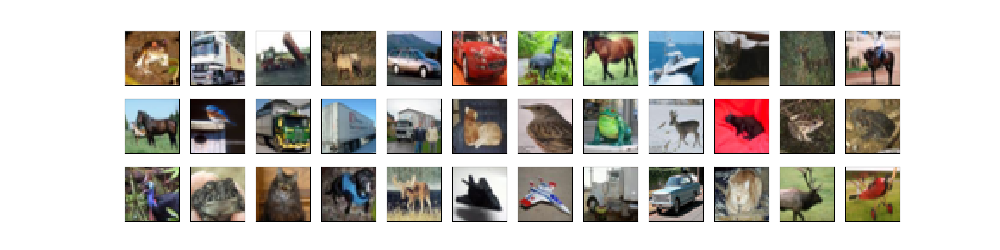

## CIFAR-10 Classification by MLP+CNN (使用多层感知机和CNN实现对CIFAR-10数据集图像分类)

### 项目背景
>  该项目出发点在于尝试搭建MLP和CNN两种模型，对CIFAR-10的图像数据实现基本分类操作，也是最为基础的图像分类器搭建方法，主要是对比一下CNN相比于MLP识别准确率的提高程度。没有做特别深层的网络模型，主要还是运算资源不足，个人电脑耗时过久，一旦中间有异常中断，调试非常耗时。所以只进行了简单有效的模型实现。并验证了一下预测准确率程度。同时最后也做了一下数据增强的引入。
  
### 代码流程
|名称|作用|
|:-------------:|:-------------:|
|1.CNN_model_load|通过Keras实现CNN模型搭建并读取模型结构和参数信息|
|2.data_analysi|对CIFAR-10数据集进行简单的解析|
|3.MLP_classifier|通过Kears实现MLP分类器训练并识别|
|4.CNN_classifer|通过Kears实现CNN分类器训练并识别|
|5.data_enhancement|引入数据增强处理图像数据集|

### 效果图
#### ·CIFAR-10数据集样例数据显示

#### ·数据增强前部分数据显示

#### ·数据增强后部分数据显示

