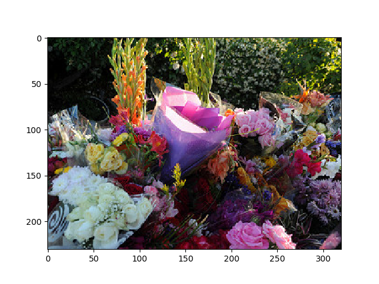
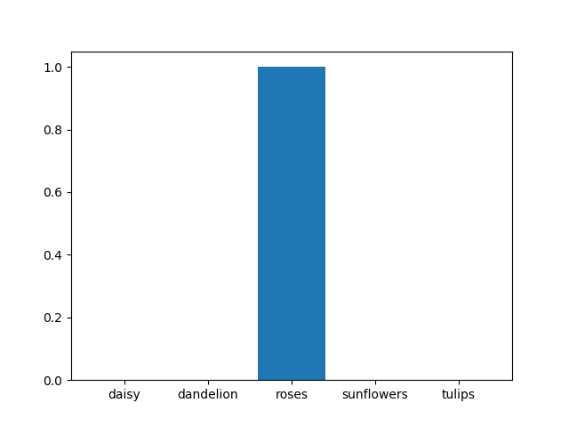

## Transfer Learning for Flowers Classifier by VGG16 
## (迁移学习-基于VGG-16模型快速实现大数据集下花朵的分类器的训练和分类)

### 项目背景
>  该项目出发点在于尝试实现一个较为基础的迁移学习范例。该项目中，迁移学习对象模式VGG-16图像特征提取网络，目标实现效果是对5中花朵进行分类。传统手动搭建CNN网络并进行数据对齐，模型训练调参，会消耗大量时间，而且模型未必合适对应的图像特征提取。在迁移学习中，核心思想是将已有训练好的特征提取模型迁移过来，我们需要做的是在模型的标准输出尾部，衔接一个自己对应的全连接层，以实现5分类。因为VGG-16模型的标准输出是固定的，为长度是4096的特征向量，我们需要将这个高度隐含图像特征信息的向量，对齐我们目标的5种花的分类结果。这样迁移引用已有比较完善的模型好处是，可以为训练节约大量时间。而且可以得到很不错的特征提取效果，是的分类器的训练比较靠谱。
  
### 代码流程
|名称|作用|
|:-------------:|:-------------:|
|1.VGG16_model|加载VGG-16模型并下载内部对应参数|
|2.data_load|下载并加载5类花朵数据集|
|3.data_preprocess|将花朵数据通过VGG-16模型并保存模型输出结果|
|4.model_training|迁移VGG-16模型尾部衔接全连接层并加载上面结果数据训练|
|5.example_test|挑选一个数据集实例使用模型预测并输出预测概率分布|

### 效果图
#### ·目标预测实例花朵图像

#### ·模型预测概率分布统计

