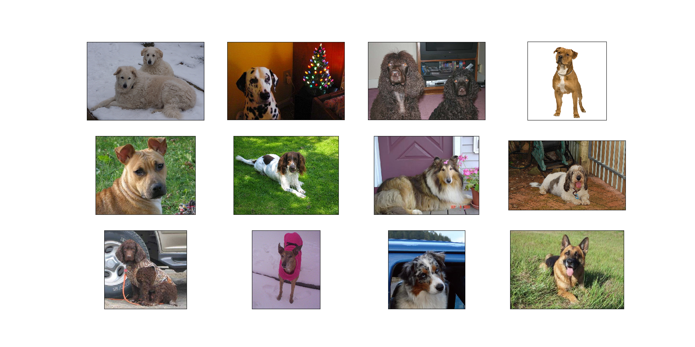

## 8.Transfer Learning for Dog Classifier by VGG16
## (迁移学习-基于VGG-16模型快速实现大数据集下狗狗的分类器的训练和分类)

### 项目背景
背景：数据集8351张图，每张都是狗狗照片，共133种。

目标：用CNN实现狗类品种分类

模型：使用ImageNet上预先训练好的VGG16

分析场景：狗类数据集较小，与ImageNet相似度较高

方法：将最后的全连接层删除，换成新的连接层。冻结前面模型的权重，只训练最后一个连接层的权重。

  
### 代码流程
|名称|作用|
|:-------------|:-------------:|
|1.data_preprocess|加载狗狗数据预处理|
|2.model_Softmax|迁移学习VGG16模型尾部衔接Softmax全连接层|
|3.model_GAP|迁移学习VGG16模型尾部衔接GAP层|

### 效果图
#### ·数据集部分图像数据展示

